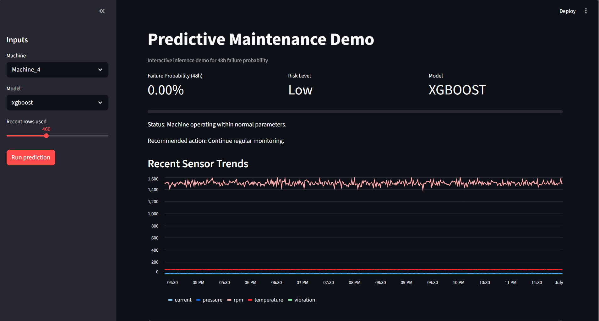
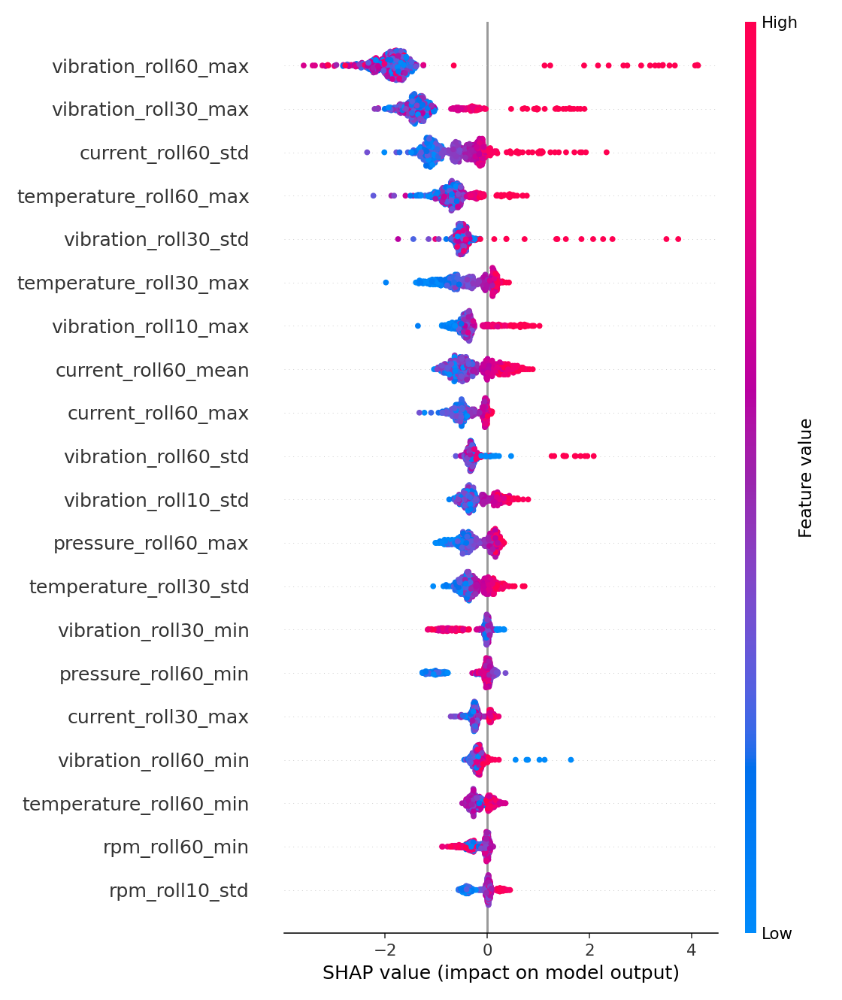
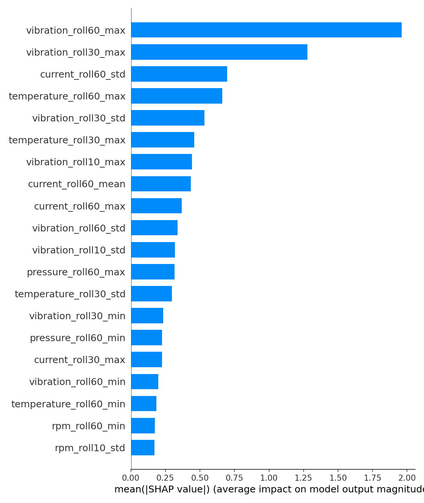
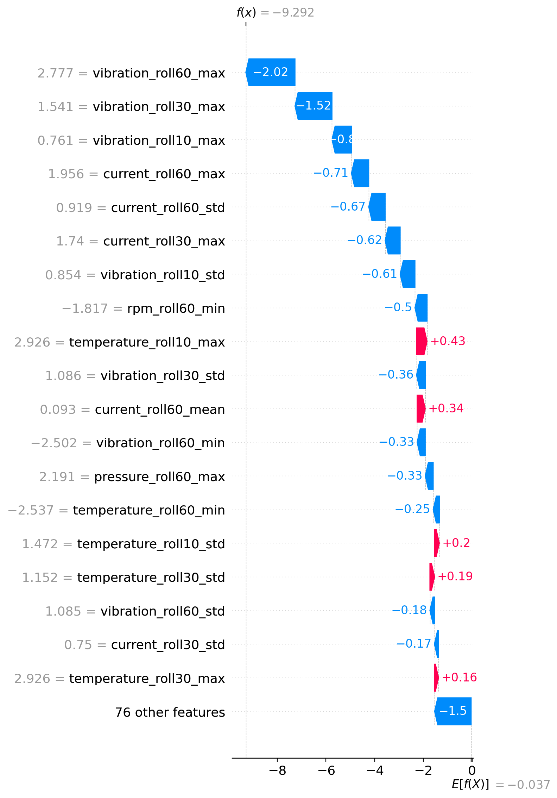

# Predictive Maintenance System — Automotive Production Line


## Description

End-to-end predictive maintenance system for industrial machinery using time-series sensor data
(temperature, vibration, pressure). Simulates an automotive production line with 5 machines,
training classical ML baselines (Random Forest, XGBoost) and a deep-learning LSTM model to predict
machine failures **48 hours in advance**.

## Project Highlights

- End-to-end predictive maintenance workflow from synthetic telemetry generation to actionable
  maintenance recommendations.
- Seven notebooks fully populated with analysis, visualisations, model comparison, and
  explainability outputs.
- Modular production-style codebase under `src/` for simulation, preprocessing, features,
  modelling, evaluation, and inference.
- Explainability layer powered by SHAP to support transparent, auditable decision-making.
- Interactive Streamlit demo for model selection, risk scoring, and sensor-trend inspection.

---

## Motivation / Problem Statement

Unplanned equipment downtime in manufacturing costs billions of dollars annually. By predicting
failures before they occur, maintenance teams can act proactively, reducing costly unplanned
shutdowns, extending equipment life, and improving overall production efficiency.

This project demonstrates a realistic, end-to-end predictive-maintenance pipeline that could be
deployed on an automotive production line, from raw sensor ingestion all the way to actionable
human-readable alerts.

---

## Project Architecture

```
Raw Sensor Data (CSV)
        │
        ▼
┌─────────────────┐
│  Data Simulation │  ← src/data/simulate_data.py
└────────┬────────┘
         │
         ▼
┌─────────────────┐
│  Preprocessing   │  ← src/data/preprocess.py
│  (clean, scale,  │
│   split)         │
└────────┬────────┘
         │
         ▼
┌─────────────────┐
│ Feature Engineer.│  ← src/features/feature_engineering.py
│ (rolling, lag,   │
│  interactions)   │
└────────┬────────┘
         │
    ┌────┴─────┐
    │          │
    ▼          ▼
┌────────┐ ┌──────────┐
│Baseline│ │   LSTM   │  ← src/models/
│RF/XGB  │ │  model   │
└────┬───┘ └────┬─────┘
     │           │
     └─────┬─────┘
           │
           ▼
  ┌─────────────────┐
  │   Evaluation    │  ← src/evaluation/metrics.py
  │ (Precision,     │
  │  Recall, F1,    │
  │  ROC-AUC, SHAP) │
  └────────┬────────┘
           │
           ▼
  ┌─────────────────┐
  │  Prediction API │  ← src/predict.py
  │  (CLI output)   │
  └─────────────────┘
```

---

## Dataset

The dataset is **fully simulated** using `src/data/simulate_data.py`.

| Property      | Value                                                                |
| ------------- | -------------------------------------------------------------------- |
| Machines      | 5 (Machine_1 … Machine_5)                                            |
| Sensors       | temperature (°C), vibration (mm/s), pressure (bar), rpm, current (A) |
| Sampling rate | 1 minute                                                             |
| Duration      | 6 months (~260 000 rows per machine)                                 |
| Target        | `failure_within_48h` (binary: 1 if failure in next 48 h)             |
| Extra         | `time_to_failure` (hours until next failure event)                   |

Failure patterns are injected as **gradual degradation** in the 48 hours preceding each failure
event, with added Gaussian noise for realism.

---

## Pipeline Overview

| Step                   | Notebook                         | Script                                |
| ---------------------- | -------------------------------- | ------------------------------------- |
| 1. Data Generation     | `01_data_generation.ipynb`       | `src/data/simulate_data.py`           |
| 2. EDA & Preprocessing | `02_eda_and_preprocessing.ipynb` | `src/data/preprocess.py`              |
| 3. Feature Engineering | `03_feature_engineering.ipynb`   | `src/features/feature_engineering.py` |
| 4. Baseline Models     | `04_baseline_models.ipynb`       | `src/models/baseline.py`              |
| 5. LSTM Model          | `05_lstm_model.ipynb`            | `src/models/lstm_model.py`            |
| 6. Evaluation          | `06_evaluation.ipynb`            | `src/evaluation/metrics.py`           |
| 7. SHAP Explainability | `07_explainability_shap.ipynb`   | —                                     |

---

## Quick Start (Day 1)

Use this section to get an end-to-end baseline running as fast as possible.

### 1) Create and activate virtual environment

Windows PowerShell:

```powershell
python -m venv venv
.\venv\Scripts\Activate.ps1
```

Linux / macOS:

```bash
python -m venv venv
source venv/bin/activate
```

### 2) Install dependencies

```bash
pip install -r requirements.txt
```

Optional (for LSTM):

```bash
pip install -r requirements-lstm.txt
```

### 3) Run full pipeline (baseline product flow)

```bash
python -m src.run_pipeline --skip-lstm
```

This executes:

- data simulation
- preprocessing
- feature engineering
- baseline training (Random Forest + XGBoost)
- evaluation metrics and figures

### 4) Optional: train LSTM

```bash
python -m src.run_pipeline
```

For a CPU-friendly first run, use a capped sequence sample:

```bash
python -m src.run_pipeline --lstm-max-train-samples 100000 --lstm-epochs 20
```

### 5) Optional: run reproducible SHAP (script, no notebook required)

```bash
python -m src.evaluation.shap_xgboost --export-assets
```

Or run the full baseline pipeline including SHAP:

```bash
python -m src.run_pipeline --skip-lstm --with-shap
```

### 6) Product-style inference

```bash
python -m src.predict --machine Machine_3 --model xgboost
python -m src.predict --machine Machine_3 --model lstm
```

### 7) Interactive demo (Streamlit)

```bash
pip install -r requirements-demo.txt
streamlit run demo_streamlit.py
```

The demo lets you:

- choose machine and model (XGBoost, Random Forest, LSTM)
- view 48h failure probability and risk bucket
- see recommended maintenance action
- inspect recent sensor trends in real time

Demo screenshot:



The interface shows machine selection, model choice, 48h failure probability, risk level, and
recent sensor trends in a single operational view.

---

## Key Results

| Model         | Precision | Recall | F1     | ROC-AUC |
| ------------- | --------- | ------ | ------ | ------- |
| Random Forest | 0.9937    | 0.9718 | 0.9827 | 0.9977  |
| XGBoost       | 0.9915    | 0.9776 | 0.9845 | 0.9971  |
| LSTM          | 0.9623    | 0.9454 | 0.9538 | 0.9950  |

Current recommendation: **XGBoost** is the best baseline model for the portfolio version of the
project because it achieves the highest recall and F1 score, which is preferable in predictive
maintenance where missing a real failure is more costly than raising an additional inspection.

Note: the LSTM result above comes from the saved `.keras` model trained on a 100,000-sequence
subsample for CPU-friendly experimentation. A full-sequence training run may improve or stabilise
the deep-learning result, but for the current portfolio version XGBoost remains the stronger model.

### Model Selection Rationale

- **XGBoost** is the recommended production-style model for this repository because it provides the
  best overall balance of recall, F1, training speed, and interpretability with SHAP.
- **Random Forest** is a strong benchmark, but slightly underperforms XGBoost on recall and F1.
- **LSTM** captures temporal structure explicitly, but on the current simulated dataset and CPU-only
  training setup it did not beat the tree-based models.

In a maintenance use case, recall is especially important because a missed failure is often more
expensive than an extra inspection. For that reason, the portfolio recommendation remains XGBoost.

---

## Business Impact

- Predicting failures 48 hours in advance gives maintenance teams enough time to schedule service
  during planned downtime instead of reacting to unexpected line stoppages.
- The product-style output translates model scores into actions, making the system easier to use by
  operations or maintenance teams that do not work directly with ML metrics.
- SHAP explanations make alerts auditable: when the model raises risk, the team can inspect the
  dominant sensor patterns behind the decision.

Example operational value proposition:

> “Instead of responding after a breakdown, the plant can inspect machines with elevated vibration
> and current instability before failure, reducing unplanned downtime and improving maintenance
> planning.”

---

## Explainability (SHAP)

To make model decisions transparent, SHAP was run on the XGBoost baseline model using a 2,000-row
sample from the engineered test set.

Generated artifacts:

- Global summary (beeswarm): `assets/images/shap_summary_xgboost.png`
- Global importance (bar): `assets/images/shap_bar_xgboost.png`
- Local case explanation (waterfall): `assets/images/shap_waterfall_xgboost_row0.png`







Top SHAP drivers (mean absolute contribution):

1. `vibration_roll60_max`
2. `vibration_roll30_max`
3. `current_roll60_std`
4. `temperature_roll60_max`
5. `vibration_roll30_std`
6. `temperature_roll30_max`
7. `vibration_roll10_max`
8. `current_roll60_mean`
9. `current_roll60_max`
10. `vibration_roll60_std`

Interpretation:

- Vibration and current trend features dominate the prediction logic.
- This is consistent with realistic mechanical degradation signals in rotating equipment.
- The model is not a black box anymore: each alert can be justified by concrete sensor dynamics.

Interview-ready takeaway:

> “For high-risk predictions, SHAP consistently highlights abnormal vibration peaks and current
> variability as the primary contributors, which supports maintenance scheduling decisions.”

---

## Product-Style Output Example

```
============================================================
🔍 PREDICTIVE MAINTENANCE SYSTEM — Automotive Line
============================================================
📍 Machine:     Machine_3
🕐 Timestamp:   2026-04-07 14:00:00
⚙️  Model Used:  XGBoost
------------------------------------------------------------
📈 Risk Level:  High
⚠️  Business Status: Elevated failure risk detected.
📊 Failure Probability (next 48h): 80.4%
🧭 Interpretation: Machine_3 is likely to fail within the next 48 hours.
🔧 Recommended Action: Schedule maintenance within 24 hours.
============================================================
```

Example of a low-risk prediction:

```text
XGBoost on Machine_3
Probability: 0.0%
Risk level: Low
Recommended action: Continue regular monitoring.

LSTM on Machine_3
Probability: 0.8%
Risk level: Low
Recommended action: Continue regular monitoring.
```

---

## Limitations And Next Steps

- The dataset is simulated, so the project demonstrates workflow and modelling practice rather than
  performance on proprietary industrial telemetry.
- The LSTM was trained on a 100k-sequence subsample for practical CPU runtime, so its result is not
  the upper bound of what sequence modelling could achieve.
- There is no live serving layer yet; predictions are exposed through a CLI rather than an API or
  dashboard.
- Thresholds are currently fixed. In a production setting, they should be tuned against business
  cost assumptions such as downtime cost versus false-positive inspections.

Natural next extensions:

1. Train the LSTM on the full sequence set using longer runtime or GPU compute.
2. Add a small API or Streamlit dashboard for real-time machine monitoring.
3. Introduce cost-sensitive threshold tuning and maintenance scheduling logic.
4. Validate the pipeline on real plant or public industrial sensor data.

---

## How to Run

```bash
# 1. Clone the repository
git clone https://github.com/adrivargascouri/predictive-maintenance-automotive.git
cd predictive-maintenance-automotive

# 2. Install dependencies
pip install -r requirements.txt

# Optional: install deep-learning dependencies for LSTM
pip install -r requirements-lstm.txt

# 3. Run complete pipeline (recommended)
python -m src.run_pipeline --skip-lstm

# 3b. Run baseline pipeline and SHAP in one command
python -m src.run_pipeline --skip-lstm --with-shap

# 4. Optional: include LSTM training
python -m src.run_pipeline

# CPU-friendly LSTM test run
python -m src.run_pipeline --lstm-max-train-samples 100000 --lstm-epochs 20

# 5. Or run notebooks in order (inside notebooks/)
jupyter notebook

# 6. Make a prediction
python -m src.predict --machine Machine_3 --model lstm
python -m src.predict --machine Machine_3 --model xgboost

# 7. Run SHAP script directly (reproducible explainability)
python -m src.evaluation.shap_xgboost --export-assets

# 8. Launch interactive demo
pip install -r requirements-demo.txt
streamlit run demo_streamlit.py
```

---

## Suggested 3-5 Week Plan

| Week         | Focus                                             | Deliverable                            |
| ------------ | ------------------------------------------------- | -------------------------------------- |
| 1            | Data simulation, labels, preprocessing validation | Clean train/val/test pipeline          |
| 2            | Feature engineering + baseline models             | Baseline benchmark with metrics        |
| 3            | LSTM training and comparison                      | Model comparison (ROC-AUC, F1, recall) |
| 4            | SHAP + product-style reporting                    | Explainable predictions per machine    |
| 5 (optional) | Refactor, tests, README polish                    | Interview-ready GitHub project         |

---

## Tech Stack

| Tool                     | Purpose                               |
| ------------------------ | ------------------------------------- |
| **Python 3.10+**         | Core language                         |
| **pandas / numpy**       | Data manipulation                     |
| **scikit-learn**         | Preprocessing, Random Forest, metrics |
| **XGBoost**              | Gradient boosted trees baseline       |
| **TensorFlow / Keras**   | LSTM deep learning model              |
| **SHAP**                 | Model explainability                  |
| **matplotlib / seaborn** | Visualisation                         |
| **Jupyter**              | Interactive notebooks                 |

---

## License

This project is licensed under the [MIT License](LICENSE).

---

## Final Delivery Checklist

- [x] End-to-end pipeline implemented and validated.
- [x] Baseline models (Random Forest, XGBoost) trained and compared.
- [x] LSTM model trained and integrated into evaluation/prediction flow.
- [x] Seven notebooks completed with executed outputs.
- [x] SHAP explainability assets generated and documented.
- [x] Product-style prediction output implemented.
- [x] Streamlit demo added with run instructions.
- [x] README finalised for interview-ready portfolio presentation.
